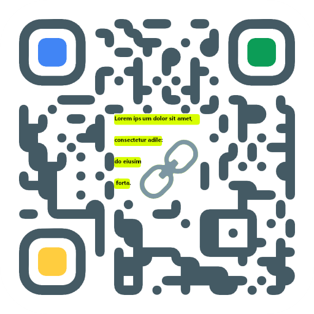

# FragmentQR Chrome Extension
 ##### *Yonah Aviv*
<a href="https://www.paypal.com/cgi-bin/webscr?cmd=_donations&business=CBYMNSA8XYYY2&item_name=To+continue+doing+whatever+I+am+doing&currency_code=CAD&source=url">
 
</a>


 -----

<a href="https://bit.ly/GetFragmentedQR" class="btn" title="Get it on the Chrome Web Store" padding="0">
  
   
</a>

---- 
**FragmentQR is a Chrome extension that simplifies linking to certain text on a webpage by letting you select text and copy it as a text fragment to generate a QR code for it, that will highlight 
the text in yellow when scanned. [Like this](https://example.com/#:~:text=use%20in%20illustrative%20examples%20in%20documents.%20You%20may%20use%20this%20domain%20in%20literature%20without)**


### What does FragmentQR do?

FragmentQR adds a an option to the context menu to copy a text fragment when selecting text, and enables generating a QR code for the text fragment in an extension popup by clicking the FragmentQR toolbar button.
 To make the process easier, I added keyboard shortcuts:

```Ctrl/⌘ + ⇧ + L``` to copy the text fragment to your clipboard,  ```Ctrl/⌘ + Q``` to open the extension popup, and a ```📋```(Paste) button in the popup to paste the text fragment link into the popup to generate a QR code. 

When someone scans that QR or just goes to the link you copied, A feature called Scroll to text fragment allows the text fragment to be detected when they load the webpage, and will scroll your selected text into view and be highlighted in yellow🟨.

Currently scanning the QR code to see the highlights will only work Android.

### Other Features

+ Automatically Generate QR for current tab when opening extension popup
+ text box to edit QR code
+ Paste, copy and clear buttons
+ Light and dark themes
+ Popup can be made larger
+ Button to download QR as png
+ Material design

 
<hr width=50%>

***Update on text fragments:** In Chrome 87, there is a new flag in chrome://flags that adds "copy link to text" to the context menu on Android and Desktop. However in the latest version of chrome as of November 23, 2020, it does not work.

### **What are Text Fragments?** 

**[Text Fragment](https://wicg.github.io/scroll-to-text-fragment/)** : Part of a URL that specifies a piece of text emphasized on page load and scrolled into view, not unlike a text anchor. 


>    "Text Fragments let you specify a text snippet in the URL fragment. When navigating to a URL with such a text fragment, the browser can emphasize and/or bring it to the user's attention." [Web Developers](HTTPS://web.dev)	

The text fragment can be specified in the fragment(```#```) directive of the URL after ```:~:text=```, and it will be highlighted in yellow when opened.

Syntax: ```https://foo.bar/#:~:text=textfragment```

Example:

>[https://en.wikipedia.org/wiki/Probability_distribution#cite_ref-:1_3-0:~:text=Examples
%20of%20random%20phenomena%20include%20the,
the%20results%20of%20a%20survey%2C%20etc.%5B4%5D](https://en.wikipedia.org/wiki/Probability_distribution#cite_ref-:1_3-0:~:text=Examples%20of%20random%20phenomena%20include%20the,the%20results%20of%20a%20survey%2C%20etc.%5B4%5D)

 In Chromium 80+, this feature is known as <a href="https://github.com/WICG/scroll-to-text-fragment/" title="Scroll-to-Text Fragment on GitHub">Scroll-to-Text Fragment</a>.


<hr width=50%>


### **What browsers/platforms are compatible with Text Fragments?**
- Check browser compatibility in the table below. Note: these are the browsers cab use the scroll to text fragment feature. This extension is still available on all Chromium browsers and works great as a regular QR code generator.
Examples of Chromium browsers include MS Edge and Google Chrome.

**Update:**
Chrome 87 on iOS has some new options in chrome://flags for text fragments, albeit nonfunctional.


|OS |Minimum Browser Version|
|--|--|
|Android| Chrome 85, Android WebView 81|
|Windows|Chromium 80(i.e. Chrome,MS Edge, Opera etc.)|
|Linux| Chromium 80| 
|Mac OS X| Chromium 80|

<a href="https://caniuse.com/url-scroll-to-text-fragment#tab-container:~:text=content%2Dvisibility-,Can%20I%20use" title="Check compatability of scroll to text fragment" target="_blank">Check current status</a>


### **Why does the QR code not scroll or highlight anything on my iPhone?**
+ That feature of scroll to text fragment is not available on Chrome for iOS yet.


## Issues and Changelog

### _Changelog v1.7.1_

   - [X] Fixed Issue # 9: [Unable to copy text fragments in version 1.7 #9](https://github.com/y330/FragmentQR/issues/9)


### _Changelog v1.7_

1. Fixed Issue # 5: QR now update automatically when typing in the text box
2. Revamped options page
3. minor fixes


### _Changelog v1.6_

   - Fix issue when system theme is set to light</li>
   - Minor improvements
 
   - [X] [QR does not update automatically when typing in the text box #5](https://github.com/y330/FragmentQR/issues/5#issue-720348982)
      - Until fixed, a workaround is: After you finish typing click the copy button and then the paste button. The QR code will only update when the paste button is clicked.

   
### _Changelog v1.5_

 <ol>  
  <li>New icon and name changes to FragmentQR</li>
  <li>Paste button now works.</li>
  <li>Vast UI and functionality improvements</li>
  <li>Added support for copying text framents</li>
  <li>Added keyboard shortcuts</li>
  <li>Light theme(currently does not save between sessions)</li>
 </ol>
 
 
### TODO

  - [ ] Rewrite the whole thing using a JavaScript framework, probably with Vuejs. Not sure yet.
  - [ ] Better version control(already started this; check releases tab)

----

## More Info

### Links

[**View source code**](/FragmentQR) 
> I added some basic comments to some of the .js files so feel free to check them out.

[**FragmentQR website**](https://y330.github.io/FragmentQR)

Article: [Boldly link where no one has linked before: Text Fragments](https://web.dev/text-fragments/#:~:text=Boldly%20link%20where%20no%20one%20has%20linked%20before:%20Text%20Fragments)

Similar extensions: 
 1. [Link to text fragment](https://chrome.google.com/webstore/detail/link-to-text-fragment/pbcodcjpfjdpcineamnnmbkkmkdpajjg)
 2. [STTF Url Generator](https://chrome.google.com/webstore/detail/sttf-url-generator/mlihnffnlcfgjkkmigdgahgpfpfddafo)


 ----
 
Report an [issue 🐞](https://github.com/y330/FragmentQR/issues/new?title=Report%20a%20bug&body=%22%3Cdetails%3E%0A%3Csummary%3EDetails%3C/summary%3E%0A%0A-%20Operating%20system*%3A%0A-%20Extension%20version*%3A%20%0A-%20Browser*%3A%0A%0A%3C/details%3E%0A%0A**Steps%20to%20reproduce%20the%20bug**%0A%0A**What%20is%20the%20bug/issue%3F**%0A%0A**Screen%20recording%20or%20screenshot**%0A%0A%22) or Suggest a [new feature 🔮](https://github.com/y330/FragmentQR/issues/new?title=Suggest%20a%20new%20feature%F0%9F%94%AE&body=%23%23%23%20Idea%3A%0A%3E%20your%20idea%20here%0A%0A%23%23%23%20Code%3A%0A%60input%20your%20code%28optional%29%60) 


[ Install FragmentQR](https://chrome.google.com/webstore/detail/fragmentqr/cabodnfakameckfbbgkciiifempglloj/#:~:text=1) on the Chrome Web Store

---- 

_Disclaimer: Text fragments is not owned by FragmentQR_


 
**Copyright © 2020 Yonah Aviv**. Licensed under the [MIT License](https://raw.githubusercontent.com/y330/FragmentQR/master/LICENSE)
